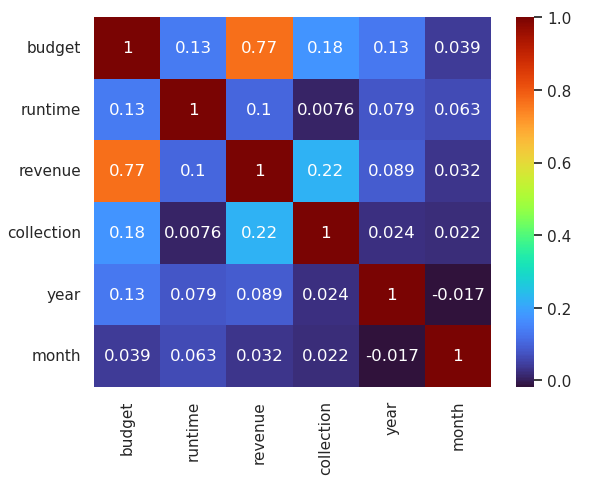
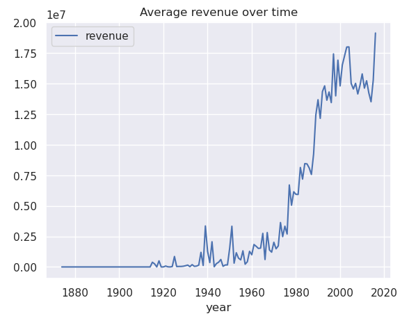
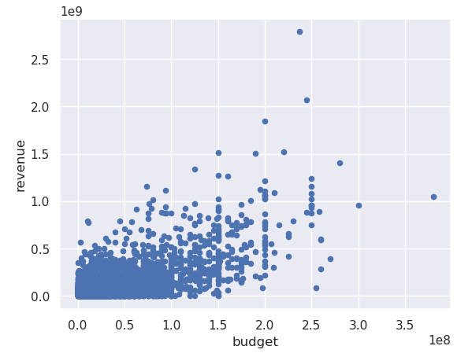
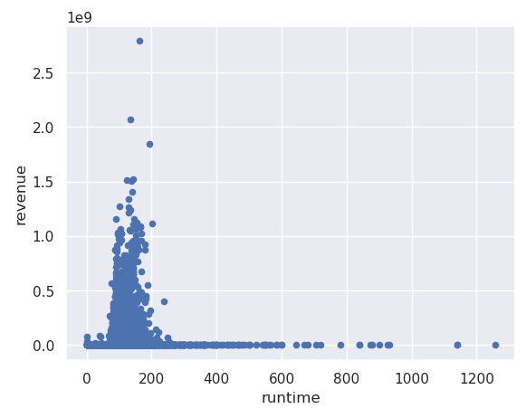

# Kaggle Movie Dataset - Exploring "Nobody knows"
 - "Nobody knows" or "Demand uncertainty" is a well-known principle / problem in the creative industries, which describes the apparent difficulty of predicting the success of a creative project as a sum of its parts. 
- Using the Kaggle Movie Dataset, explore how accurate we can get in predicting box office success based on features available prior to release (discounting reviews, etc.)
- Regression-based analysis got us RMSE between 36 and 40 million, which is not a great outcome for strong financial planning. Classification expectedly yielded better results.

| Estimator | R^2 | RMSE |
|-|-|-|
| Multiple Linear Regression | 0.59 | ~36m |
| Decision Tree Regressor | 0.61 | ~40m |
| Random Forest Regressor | 0.65 | ~37m |
| Decision Tree Classifier | 0.85 | |

## Problem statement
To determine how accurate we can get in predicting movie success at the box office, using the Kaggle Movie Dataset.

## Data
- https://www.kaggle.com/datasets/rounakbanik/the-movies-dataset

## Constraints
To conduct a useful analysis, we will only use features that would reasonably be available to us before a project is released (or, ideally, green-lit). Therefore, IMDb ratings, user reviews, etc. will not be used.

## Dropped features
'homepage', 'id', 'imdb_id', 'original_title', 'popularity', 'poster_path', 'tagline', 'title', 'video', 'vote_average', 'vote_count' were dropped because they are either not available before a movie is released, or because they wouldn't be useful numeric values for this kind of analysis.

## EDA

## Conclusion
It seems the nobody knows principle is alive and well. Even with machine learning techniques and big data available, predictions struggle to become meaningful enough to make clear business decisions. This seems to be supported by academic literature on the topic. For example, in their paper A Machine Learning Approach to Predict Movie Box-Office Success [1], using only pre-release features, the authors' neural network achieves only 68% accuracy.

### Correlation vs Causation
Looking at the correlation between features, we can quickly understand why our models underperform:

- Highest correlation is **Budget**, but higher budgeted movies tend to be blockbusters with big releases and big marketing spend, so this is to be expected. Perhaps it's surprising that the correlation is as high as it is.
- Next we have **Collection**, which makes sense because only movies successful enough to get a sequel end up in this category. Could be interesting to compare average revenue of first installments and their respective sequels.
- After that, **Year**, but since **Budget** is increasing over time and we see a high correlation here, this is to be expected as well.
- **Runtime** plays a role as well, but p-values quickly fades into the single digits after that.

### Limitations
- When looking at break-even, I simply subtracted budget and revenue from each other. In reality, this calculation is much more complicated and takes into account equity and non-equity funding, marketing spend as well as the long tail with various VOD and disk releases. However, I still wanted to give it a try with the data available.
- More features are technically available, such as the cast and the production companies, which could easily improve the results. However, recreating these features as one-hot-encoded dummies exceeded the memory limitations of this notebook. It would be very interesting to take into account the star power of any given actor by looking at this actor's filmographic revenue in isolation. While this would introduce multicolinearity, it is a feature we would feasably have available to us and should use it, see the below cited paper [1]

### Source:
1. https://dspace.bracu.ac.bd/xmlui/bitstream/handle/10361/9015/13301028,13301019_CSE.pdf?sequence=1